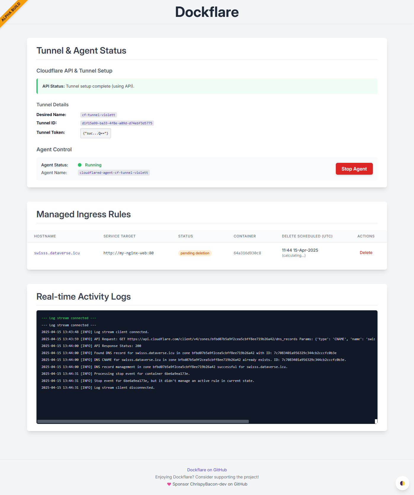

<p align="center">
  <a href="https://dockflare.app" title="Now you're thinking with tunnels">
    
  </a>
</p>

<h1 align="center">Automate Cloudflare Tunnels with Docker Labels</h1>

<p align="center">
  <em>Go from container to publicly-secured URL in seconds. No manual Cloudflare dashboard configuration required.</em>
</p>
<p align="center">
  <a href="https://dockflare.app/podcast" target="_blank" rel="noopener noreferrer">
    
  </a>
</p>
<p align="center">
  <a href="https://github.com/ChrispyBacon-dev/DockFlare/releases/tag/v2.1.1"></a>
  <a href="https://hub.docker.com/r/alplat/dockflare"></a>
  <a href="https://www.python.org/"></a>
  <a href="https://github.com/ChrispyBacon-dev/DockFlare/blob/main/LICENSE.MD"></a>
  <a href="#"></a>
</p>

<p align="center">
  <a href="https://dockflare.app">🌐 Website</a> ·
  <a href="https://dockflare.app/docs">📚 Documentation</a> ·
  <a href="https://github.com/ChrispyBacon-dev/DockFlare/issues">🐛 Report a Bug</a> ·
  <a href="https://github.com/sponsors/ChrispyBacon-dev">❤️ Sponsor</a>
</p>

<p align="center">
  
</p>

---

## Introduction

DockFlare is a powerful, self-hosted ingress controller that simplifies Cloudflare Tunnel and Zero Trust management. It uses Docker labels for automated configuration while providing a robust web UI for manual service definitions and policy overrides.

It enables secure, hassle-free public access to both Dockerized and non-Dockerized applications with minimal direct interaction with Cloudflare, making it the perfect tool for centralizing and streamlining your access management.

### ✨ What's New in DockFlare 2.1: The Usability & Security Update

This release overhauls the user experience, focusing on security and ease of use.

- **Browser-Based Setup**: Say goodbye to `.env` files! A new "Pre-Flight" wizard guides you through the initial setup in your browser.
- **Enhanced Security**: The UI is now password-protected. All credentials are encrypted and stored in a secure `dockflare_config.dat` file.
- **Seamless Migration**: Existing users are automatically guided through a simple migration process to adopt the new security model.
- **Full UI Configuration**: Core settings can now be modified directly from the UI after setup.
- **⚠️ Breaking Change**: `.env` files are no longer used for configuration after the initial setup/migration.

## Getting Started & Documentation

For comprehensive documentation, please refer to the official project website:

- **[Quick Start Guide](https://dockflare.app/docs)** - Step-by-step guide to get up and running.
- **[Label Reference](https://dockflare.app/docs/container-labels)** - Detailed information on all available Docker labels.
- **[Advanced Configuration](https://dockflare.app/docs/managing-dns-zones)** - Details on multi-zone setups, external mode, and more.

### Prerequisites

Before you begin, ensure you have the following:
- Docker & Docker Compose installed.
- A Cloudflare Account.
- Your **Cloudflare Account ID**.
- The **Zone ID** for the domain you wish to use.
- A **Cloudflare API Token** with the following permissions:
    - `Account:Cloudflare Tunnel:Edit`
    - `Account:Account Settings:Read`
    - `Account:Access: Apps and Policies:Edit`
    - `Zone:Zone:Read`
    - `Zone:DNS:Edit`


<details>
<summary>🚀 Quick Start Docker Compose</summary>

1.  **Create `docker-compose.yml`**:
    ```yaml
    version: '3.8'
    services:
      dockflare:
        image: alplat/dockflare:stable
        container_name: dockflare
        restart: unless-stopped
        ports:
          - "5000:5000"
        volumes:
          - /var/run/docker.sock:/var/run/docker.sock:ro
          # This volume is crucial for persisting your encrypted configuration
          - ./dockflare_data:/app/data
        networks:
          - cloudflare-net

    volumes:
      dockflare_data:

    networks:
      cloudflare-net:
       name: cloudflare-net
       external: true
    ```

2.  **Run DockFlare**:
    ```bash
    docker compose up -d
    ```

3.  **Complete the Pre-Flight Setup**: Open `http://your-server-ip:5000` in your browser. You will be guided through a one-time setup wizard to enter your Cloudflare credentials and create a password for the UI.

4.  **For Existing Users**: If you are upgrading, DockFlare will detect your old `.env` file and automatically guide you through a quick migration process.

</details>

## 🏷️ How It Works & Labeling Containers

DockFlare's power comes from its flexible, layered approach to configuration.

- **Access Groups First (Recommended)**: The easiest and most maintainable way to secure services is to create an **Access Group** in the UI and apply it with a single label.
- **Individual Labels for One-Offs**: For services that don't fit a group, you can still use individual `dockflare.access.*` labels for initial configuration.
- **UI for Dynamic Overrides**: The Web UI can override the access policy for any service, whether it was configured by a group or by individual labels. UI changes are persistent and stored in the encrypted `dockflare_config.dat` file.

<details>
<summary>📝 Labeling Your Containers (Examples)</summary>

#### 1. Recommended Method: Using an Access Group

Assuming you created an Access Group with the ID `nas-family` in the UI:

```yaml
services:
  picoshare:
    image: mtlynch/picoshare
    labels:
      - "dockflare.enable=true"
      - "dockflare.hostname=files.example.com"
      - "dockflare.service=http://picoshare:8080"

      # Apply the entire policy with one label:
      - "dockflare.access.group=nas-family"
```

#### 2. Alternative Method: Using Individual Labels

For a service with a unique, one-off policy:

```yaml
services:
  my-service:
    image: nginx:latest
    labels:
      - "dockflare.enable=true"
      - "dockflare.hostname=my-service.example.com"
      - "dockflare.service=http://my-service:80"

      # Optional individual labels for a one-off policy
      - "dockflare.access.policy=authenticate"
      - "dockflare.access.allowed_idps=YOUR_IDP_UUID_HERE"
```

</details>

<details>
<summary>🛡️ All Access Policy Labels (for one-off configs)</summary>

Use these labels only when **not** using `dockflare.access.group`.

| Label | Description | Default | Example |
| :--- | :--- | :--- | :--- |
| `dockflare.access.policy` | Type: `bypass` (public app), `authenticate` (IdP login), `default_tld` (inherits from `*.domain.com` policy). If unset, service is public (no Access App). | (None/Public) | `dockflare.access.policy="authenticate"` |
| `dockflare.access.name` | Custom name for the Cloudflare Access Application. | `DockFlare-{hostname}` | `dockflare.access.name="My Web App Access"` |
| `dockflare.access.session_duration` | Session duration (e.g., `24h`, `30m`). | `24h` | `dockflare.access.session_duration="1h"` |
| `dockflare.access.custom_rules` | JSON string array of [Cloudflare Access Policy rules](https://developers.cloudflare.com/api/operations/access-policies-create-an-access-policy). Overrides basic `access.policy` decisions. | (None) | `'...=[{"email":{"email":"user@example.com"},"action":"allow"},{"action":"block"}]'` |
| ... | *Other `access.*` labels for launcher visibility, IdPs, etc. are also available.* | | |


</details>

## License

DockFlare is open-source software licensed under the [GPL-3.0 license](LICENSE.MD).

## Star History

[](https://www.star-history.com/#ChrispyBacon-dev/DockFlare&Date)